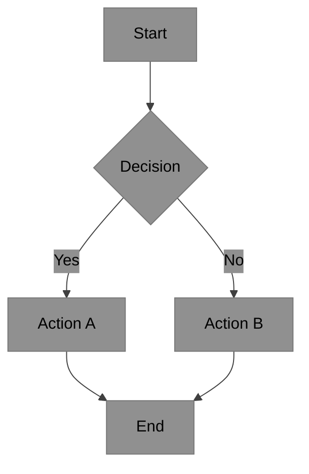
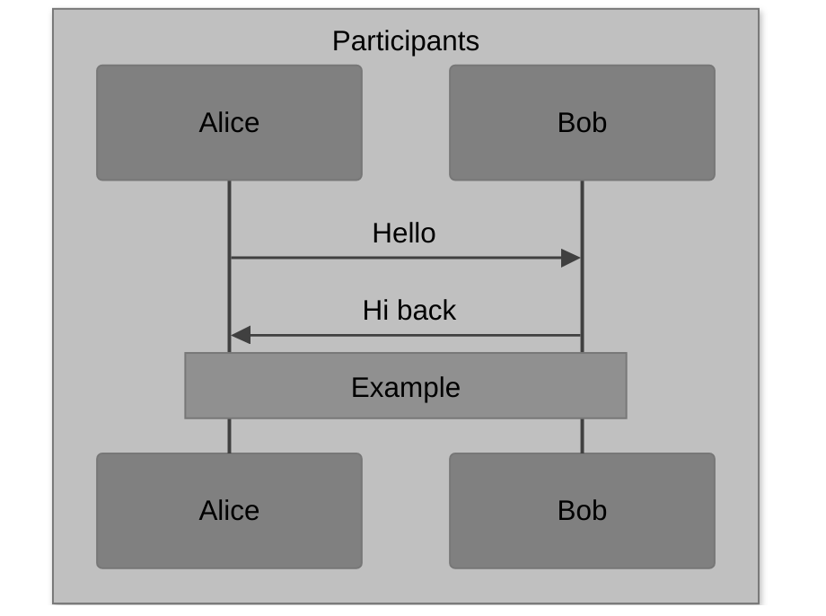
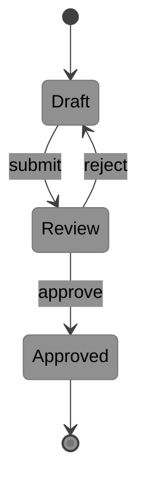

# Mermaid Diagram Standards

Legend (from RFC2119): !=MUST, ~=SHOULD, ≉=SHOULD NOT, ⊗=MUST NOT, ?=MAY.

**⚠️ See also**: [markdown.md](./markdown.md) | [main.md](../main.md)

## Standards

- ! Include `%%{init:...}%%` theme directive at the start of every Mermaid block
- ! Use the `base` theme with explicit grayscale overrides (not built-in themes)
- ! For `sequenceDiagram` readability on GitHub/Gist renderers, do not rely on `init.background` or `themeCSS` alone
- ! For `sequenceDiagram` readability on GitHub/Gist renderers, place participant declarations inside a grey `box ... end` block
- ! When using `box` in `sequenceDiagram`, place only participant declarations inside the block; message lines and notes must remain outside
- ! Use black text with grayscale fills for documentation diagrams
- ~ Keep diagrams focused: one concept per diagram
- ~ Provide a text description or caption alongside every diagram
- ~ Validate Mermaid rendering fixes with a closed-loop workflow: minimal gist, Playwright render, screenshot inspection
- ~ Use a minimal reproducer gist before patching large documents
- ~ Treat renderer quirks as diagram-type-specific; `sequenceDiagram` workarounds SHOULD NOT be generalized to other Mermaid diagram types without testing
- ≉ Create diagrams with more than 20 nodes in one block; split into focused diagrams
- ⊗ Rely solely on color to convey meaning (use labels and shapes too)
- ⊗ Ship low-contrast diagrams (for example, missing init theme or light-on-light text)

## Color Palette

- `#909090` (medium gray) - primary nodes, note backgrounds - black text
- `#808080` (darker gray) - secondary nodes, actor backgrounds - black text
- `#707070` (darkest gray) - tertiary nodes - black text
- `#404040` (near-black) - lines, connectors, actor lines, signals
- `#000000` - all text labels on grayscale backgrounds

## Init Directive (Required)

Prepend to every Mermaid block:

```mermaid
%%{init: {'theme': 'base', 'themeVariables': {
  'primaryColor': '#909090',
  'secondaryColor': '#808080',
  'tertiaryColor': '#707070',
  'primaryTextColor': '#000000',
  'secondaryTextColor': '#000000',
  'tertiaryTextColor': '#000000',
  'lineColor': '#404040',
  'noteTextColor': '#000000',
  'noteBkgColor': '#909090',
  'actorBkg': '#808080',
  'actorTextColor': '#000000',
  'actorLineColor': '#404040',
  'signalColor': '#404040'
}}}%%
```

For `stateDiagram-v2`, add these keys to the existing `themeVariables` map
(do not replace the base variables above):

```text
  'stateLabelColor': '#000000',
  'compositeBackground': '#a0a0a0'
```

## Commands

See [commands.md](./commands.md).

## Patterns

- ~ Use the standard init directive (above) as a copy-paste starting point for every diagram
- ~ Keep diagrams focused: one concept per diagram, split complex flows into linked sub-diagrams
- ~ Validate rendering changes with a minimal gist before patching large documents

## Diagram Examples

### Flowchart



### Sequence Diagram (GitHub/Gist Safe)



### State Diagram


