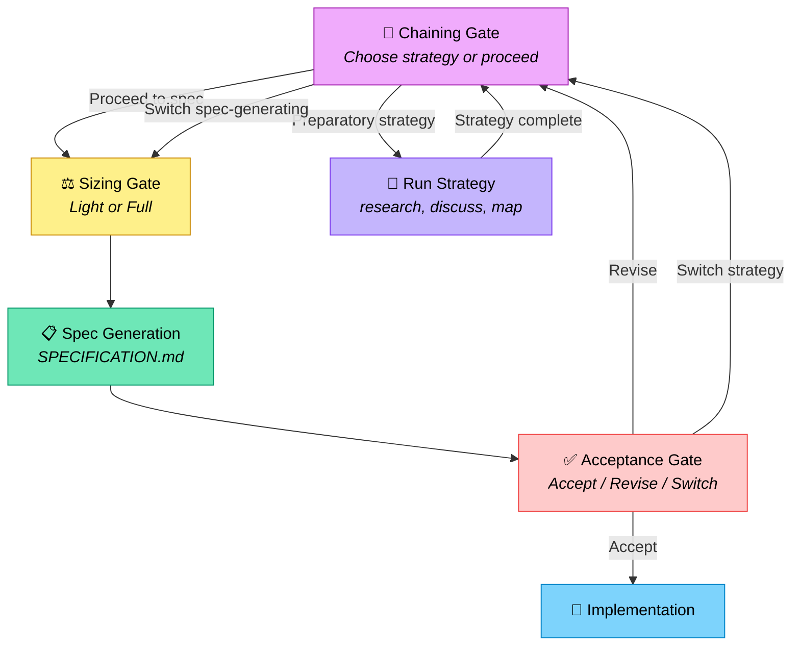

# Strategy Chaining SPECIFICATION

## Overview

Add a chaining gate and acceptance gate to the deft strategy workflow so users can
compose multiple strategies before and after spec generation. Currently, strategies
chain forward only (e.g., brownfield → interview) with no way to pause, detour into
another strategy, or reject a generated spec and loop back.

**Issue:** [#39](https://github.com/deftai/directive/issues/39)
**Branch:** `feat/strategy-chaining`

---

## Requirements

### Functional Requirements

- FR-1: A **chaining gate** MUST appear in `strategies/interview.md` immediately before the sizing gate
- FR-2: The chaining gate MUST always be shown — including when the interview strategy is invoked directly with no prior strategy
- FR-3: The chaining gate MUST present two categories of strategies:
  - **Preparatory** (research, discuss, map/brownfield) — loops back to the chaining gate after completion
  - **Spec-generating** (interview, yolo, speckit) — switches pipeline, proceeds to spec generation
- FR-4: Strategy categories MUST be sourced dynamically from `strategies/README.md` via a new `Type` column (`preparatory` | `spec-generating`)
- FR-5: The chaining gate MUST be recursive — after each completed strategy, the gate reappears
- FR-6: No strategy is ever removed from the gate. Previously-run strategies MUST display with a run count annotation (e.g., `Research (ran 1×)`)
- FR-7: Users MUST be able to re-run the same strategy multiple times
- FR-8: An **acceptance gate** MUST appear after spec generation with three options: Accept, Revise (return to chaining gate), Switch strategy
- FR-9: When the user chooses "Revise" at the acceptance gate, all prior context (completed strategies, artifacts) MUST be preserved
- FR-10: Rejected specs MUST be archived to `history/specs/` with naming that indicates they were not accepted
- FR-11: Completed strategy state MUST be tracked in `./vbrief/plan.vbrief.json` via a `completedStrategies` array
- FR-12: Each entry in `completedStrategies` MUST include: strategy name, run count, and artifact paths produced
- FR-13: Each completed strategy MUST append its artifact paths to an `artifacts` array in `plan.vbrief.json`
- FR-14: The next strategy and eventual spec generation MUST load all artifacts listed in `plan.vbrief.json`
- FR-15: The "Then: Specification" sections in brownfield.md, map.md, research.md, and discuss.md MUST be simplified to "return to interview.md chaining gate"

### Non-Functional Requirements

- NFR-1: The chaining gate MUST work in both CLI (`run spec`) and agent (SKILL.md → deft-setup) entry points
- NFR-2: The gate MUST NOT add more than one additional question to the workflow when the user wants to proceed directly to spec
- NFR-3: Custom strategies added to `strategies/README.md` with a `Type` column MUST automatically appear in the chaining gate without code changes

---

## Architecture

### Flow



### State in plan.vbrief.json

New fields on the `plan` object (extends existing vBRIEF plan schema):

```json
{
  "vBRIEFInfo": { "version": "0.5" },
  "plan": {
    "title": "Strategy chaining session",
    "status": "running",
    "completedStrategies": [
      {
        "strategy": "research",
        "runCount": 1,
        "artifacts": ["docs/research/auth-research.md"]
      },
      {
        "strategy": "discuss",
        "runCount": 2,
        "artifacts": ["auth-context.md", "auth-context-v2.md"]
      }
    ],
    "artifacts": [
      "docs/research/auth-research.md",
      "auth-context.md",
      "auth-context-v2.md"
    ],
    "items": []
  }
}
```

### Rejected Spec Naming

Archived to `history/specs/` with format:
```
history/specs/SPECIFICATION-rejected-{timestamp}.md
```

Example: `history/specs/SPECIFICATION-rejected-2026-03-15T19-23-00Z.md`

### strategies/README.md Category Column

Add a `Type` column to the strategy table:

```
| Strategy       | Command              | Type             | Use Case               |
|----------------|----------------------|------------------|------------------------|
| interview.md   | /deft:run:interview  | spec-generating  | Standard projects      |
| yolo.md        | /deft:run:yolo       | spec-generating  | Quick prototyping      |
| speckit.md     | /deft:run:speckit    | spec-generating  | Large/complex projects |
| discuss.md     | /deft:run:discuss    | preparatory      | Alignment before plan  |
| research.md    | /deft:run:research   | preparatory      | Pre-impl research      |
| map.md         | /deft:run:map        | preparatory      | Existing codebases     |
| brownfield.md  | /deft:run:brownfield | preparatory      | Existing codebases     |
```

---

## Implementation Plan

### Phase 1: Schema & State (no dependencies)

#### Task 1.1: Extend plan.vbrief.json schema
- Add `completedStrategies` array and `artifacts` array to the vBRIEF plan schema
- Update `vbrief/vbrief.md` to document the new fields
- Update `vbrief/schemas/vbrief-core.schema.json` if local schema copy exists
- Dependencies: none
- Acceptance: schema documentation includes `completedStrategies` with strategy name, runCount, and artifact paths; `artifacts` flat array documented
- (traces: FR-11, FR-12, FR-13)

### Phase 2: Strategy categorization (no dependencies)

#### Task 2.1: Add Type column to strategies/README.md
- Add `Type` column with `preparatory` or `spec-generating` for each strategy
- Document the meaning of each category and how custom strategies should declare their type
- Dependencies: none
- Acceptance: every strategy in the table has a Type; README explains both categories clearly
- (traces: FR-3, FR-4, NFR-3)

### Phase 3: Chaining gate (depends on Phase 1, Phase 2)

#### Task 3.1: Add chaining gate section to strategies/interview.md
- Insert new "Chaining Gate" section immediately before the existing "Sizing Gate" section
- Gate MUST always be shown (FR-2)
- Gate presents preparatory strategies (loop back) and spec-generating strategies (switch) as two groups
- Gate reads strategy categories from README.md (FR-4)
- Previously-run strategies show run count annotation (FR-6)
- Gate is recursive — reappears after each completed strategy (FR-5)
- Users can re-run strategies (FR-7)
- Spec-generating option switches the pipeline entirely
- "Proceed to specification" is always the first/default option
- Dependencies: Phase 1 (state tracking), Phase 2 (categories)
- Acceptance: interview.md contains a complete, unambiguous chaining gate section before the sizing gate; the gate specifies all behavioral rules (always show, recursive, run counts, two categories)
- (traces: FR-1, FR-2, FR-3, FR-5, FR-6, FR-7, NFR-2)

#### Task 3.2: Add acceptance gate section to strategies/interview.md
- Insert new "Acceptance Gate" section after spec generation (after the SPECIFICATION transition criteria)
- Three options: Accept, Revise (return to chaining gate), Switch strategy
- On Revise: all context preserved, return to chaining gate (FR-9)
- On rejected spec: archive to `history/specs/` with not-accepted naming (FR-10)
- Dependencies: Task 3.1
- Acceptance: interview.md contains acceptance gate section with all three options documented; rejected spec archival path specified
- (traces: FR-8, FR-9, FR-10)

### Phase 4: Update preparatory strategies (depends on Phase 3)

#### Task 4.1: Simplify brownfield.md "Then: Specification" section
- Replace current section with direction to return to interview.md chaining gate
- Remove duplicated transition logic
- Dependencies: Phase 3
- Acceptance: brownfield.md "Then: Specification" points to chaining gate; no duplicated orchestration logic remains
- (traces: FR-15)

#### Task 4.2: Simplify map.md "Then: Specification" section
- Same as Task 4.1 for map.md
- Dependencies: Phase 3
- Acceptance: map.md "Then: Specification" points to chaining gate
- (traces: FR-15)

#### Task 4.3: Simplify research.md "Then: Specification" section
- Same as Task 4.1 for research.md
- Dependencies: Phase 3
- Acceptance: research.md "Then: Specification" points to chaining gate
- (traces: FR-15)

#### Task 4.4: Simplify discuss.md "Then: Specification" section
- Same as Task 4.1 for discuss.md
- Dependencies: Phase 3
- Acceptance: discuss.md "Then: Specification" points to chaining gate
- (traces: FR-15)

#### Task 4.5: Update artifact carry-forward rules
- Add explicit rules to each preparatory strategy requiring artifact paths be appended to `plan.vbrief.json` `artifacts` array on completion
- Dependencies: Phase 3
- Acceptance: each preparatory strategy documents which artifacts it produces and the requirement to register them in plan.vbrief.json
- (traces: FR-13, FR-14)

### Phase 5: Yolo strategy alignment (depends on Phase 3)

#### Task 5.1: Update yolo.md for chaining gate compatibility
- Yolo references interview.md for shared phases; ensure the chaining gate and acceptance gate references are consistent
- Johnbot should auto-select "Proceed to specification" at the chaining gate (no detours in yolo mode)
- Dependencies: Phase 3
- Acceptance: yolo.md documents Johnbot's behavior at the chaining gate; no contradiction with interview.md
- (traces: FR-1, FR-8)

### Phase 6: Validation (depends on all previous phases)

#### Task 6.1: Cross-reference check
- Verify all internal links between strategy files resolve
- Verify strategies/README.md Type column matches actual file content
- Verify vbrief schema documentation matches the plan.vbrief.json examples
- Dependencies: Phase 5
- Acceptance: no broken cross-references; README categories match file content; schema docs consistent

#### Task 6.2: Automated content tests
- Add to existing pytest content test suite (from testbed spec):
  - **Shape checks**: interview.md must contain `## Chaining Gate` and `## Acceptance Gate` sections
  - **README Type column**: parse the strategy table, assert every row has a `Type` value that is exactly `preparatory` or `spec-generating`
  - **Category consistency**: every file tagged `preparatory` in README contains a "Then:" section referencing the chaining gate; every `spec-generating` file does not
  - **Cross-reference checks**: all internal links in updated strategy files resolve
  - **vbrief schema**: validate that `completedStrategies` and `artifacts` fields are documented in `vbrief/vbrief.md`
- Dependencies: Task 6.1
- Acceptance: all new content tests pass; `task test` includes them
- (traces: FR-1, FR-4, FR-8, FR-11, NFR-3)

#### Task 6.3: Deferred — manual behavioral walkthrough
- Deferred: invoke `/deft:run:interview`, verify chaining gate appears, select a preparatory strategy, verify it loops back, proceed to spec, verify acceptance gate appears
- Reason: tests AI agent behavior, not file structure; requires LLM-in-the-loop test harness
- Track in project backlog for future automation
- Dependencies: none (deferred)

---

## Dependency Map

```
Phase 1 (Schema) ──┐
                    ├── Phase 3 (Gates in interview.md) ── Phase 4 (Update prep strategies)
Phase 2 (README) ──┘                                   ── Phase 5 (Yolo alignment)
                                                                    │
                                                           Phase 6 (Validation)
```

Phases 1 and 2 can run in parallel.
Phase 4 tasks (4.1–4.5) can all run in parallel.
Phase 6 runs last.

---

## Testing Strategy

**Automated (pytest content suite):**
- Shape tests verify interview.md contains `## Chaining Gate` and `## Acceptance Gate`
- README Type column parsed and validated (`preparatory` | `spec-generating` only)
- Category consistency: preparatory strategies reference chaining gate, spec-generating do not
- Cross-reference tests verify all internal links between strategy files resolve
- vbrief schema docs validated for `completedStrategies` and `artifacts` fields

**Deferred:**
- Behavioral walkthrough (LLM-in-the-loop): invoke strategy, verify gates appear, test loop-back. Requires future test harness.

---

*Generated from interview — Strategy Chaining feature (#39) — 2026-03-15*
