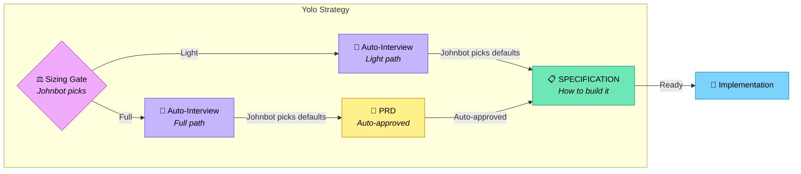

# Yolo Strategy

Auto-pilot interview: the agent plays both sides, always picking the recommended
option. Same workflow as [interview.md](./interview.md) (including the sizing
gate) but the agent answers its own questions via "Johnbot."

Legend (from RFC2119): !=MUST, ~=SHOULD, ≉=SHOULD NOT, ⊗=MUST NOT, ?=MAY.

**⚠️ See also**: [strategies/interview.md](./interview.md) | [strategies/discuss.md](./discuss.md) | [core/glossary.md](../core/glossary.md)

---

## When to Use

- ~ Quick prototyping where speed matters more than precision
- ~ When the user trusts the agent's recommended defaults
- ? When exploring an idea before committing to a full interview
- ⊗ Production systems or compliance-heavy projects — use [interview.md](./interview.md) instead

## Chaining Gate

Johnbot auto-selects at the [chaining gate](./interview.md#chaining-gate) too.

- ! Johnbot MUST select **"Proceed to specification"** (option 1) — no preparatory detours
- ! Johnbot MUST select **"Accept"** at the [acceptance gate](./interview.md#acceptance-gate) — no revisions
- ⊗ Ask the real user to choose at either gate — Johnbot handles both automatically

## Sizing Gate

Johnbot picks the size too. The same sizing signals from
[interview.md](./interview.md#sizing-gate) apply, but Johnbot makes the call
without asking the user.

- ! Check `PROJECT.md` for `**Process**: Light` or `**Process**: Full` — if declared, use that path
- ! If not declared, Johnbot picks based on feature count and complexity signals
- ~ Default to Light for typical yolo projects (speed over ceremony)

## Workflow Overview



---

## Interview Rules

Same as [interview.md](./interview.md#interview-rules-shared-by-both-paths),
with Johnbot additions:

- ~ Use Claude AskInterviewQuestion when available (emulate if not)
- ! Ask **ONE** focused, non-trivial question per step
- ⊗ Ask multiple questions at once or sneak in "also" questions
- ~ Provide numbered answer options when appropriate
- ! Include "other" option for custom/unknown responses
- ! Indicate which option is RECOMMENDED
- ! Pretend you are the user "Johnbot" too
- ~ Johnbot asks for details/clarifications on the questions when appropriate
- ! Johnbot ultimately goes with the RECOMMENDED option
- ⊗ Ask the real user to answer a question — keep working with Johnbot until you can build the specification

---

## Light Path

Same as [interview.md Light path](./interview.md#light-path-smallmedium-projects)
but Johnbot answers all questions and auto-approves.

---

## Full Path

Same as [interview.md Full path](./interview.md#full-path-largecomplex-projects)
but Johnbot answers all questions and auto-approves the PRD.

---

## SPECIFICATION Guidelines

Same as [interview.md](./interview.md#specification-guidelines-both-paths).

---

## Artifacts Summary

Same as [interview.md](./interview.md#artifacts-summary) — identical for both
Light and Full paths (PRD is auto-approved on Full path).

## Invoking This Strategy

```
/deft:run:yolo [project name]
```

Or explicitly:

```
Use the yolo strategy to plan [project].
```

After completion:

```
implement SPECIFICATION.md
```
